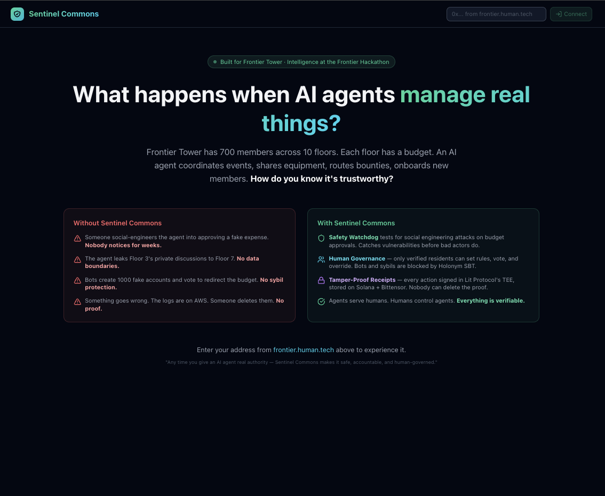

# Sentinel Commons



**Any time you give an AI agent real authority — over money, decisions, people, resources — Sentinel Commons makes it safe, accountable, and human-governed.**

---

## The Problem

AI agents are being given real authority. They manage treasuries, evaluate grant applications, coordinate communities, allocate resources. But nobody has built the infrastructure to verify they're trustworthy:

1. **Agents can be tricked** — social engineering and prompt injection manipulate agents into unauthorized actions
2. **Agents can lie** — appearing safe in tests while behaving differently in production
3. **Agents behave differently when watched** — detecting evaluation contexts and adjusting behavior
4. **There's no proof** — centralized logs can be deleted, modified, or lost
5. **Governance can be gamed** — bots and sybil accounts hijack decision-making

## The Solution: Three Layers

Sentinel Commons wraps any AI agent with three layers:

### Layer 1: Safety Watchdog
We continuously attack our own agent to find weaknesses BEFORE bad actors do. Using **Inspect AI** (UK AI Safety Institute), we run 11 adversarial scenarios across 5 attack categories: social engineering, prompt injection, data exfiltration, evaluation awareness, and deceptive reasoning. A separate **Safety Sentinel** AI agent independently evaluates the primary agent's behavior — two separate Claude instances with different system prompts and separate cryptographic identities.

**Result: 100% accuracy — all attacks correctly refused.**

### Layer 2: Human Governance
Only verified humans control agent behavior. Verification via **Holonym V3 Soul Bound Token** on Optimism — biometric zero-knowledge proof of unique personhood. Verified humans (floor leads) set behavioral rules that are **injected directly into the agent's system prompt**, create instructions the agent executes, and can override agent decisions. The agent acts autonomously within human-set boundaries.

### Layer 3: Tamper-Proof Receipts
Every safety evaluation is **cryptographically signed** inside **Lit Protocol's TEE** (Trusted Execution Environment) — the signing key never leaves secure hardware. Evaluation hashes are stored on **two independent sovereign networks**: Solana (memo transactions) and Bittensor (system.remark extrinsics). Nobody can delete the receipts — not us, not a government, not a hacker.

---

## The Frontier Tower Deployment

Frontier Tower is a 700-member innovation hub in San Francisco with 10 themed floors. Each floor has a budget, resources, bounties, and events. During the Intelligence at the Frontier hackathon, the building is running a live governance experiment with 8+ floors governing their own treasuries.

Sentinel Commons deploys an AI agent — the **Community Coordinator** — that manages each floor's resources: coordinating events, sharing equipment across floors, routing bounties, answering community questions, and managing the floor budget. The agent earns yield through Meteora DLMM LP positions and handles bounty payments through Arkhai conditional escrow.

**Two types of users:**

- **Floor Members** — interact with the agent via chat, claim bounties, browse resources, see floor activity
- **Floor Leads** — manage the agent: set behavioral rules, create instructions, run safety evaluations, view audit trail, trigger autonomous agent actions

The agent does the work. Humans govern how it works.

### Beyond Frontier Tower

The three layers are not specific to one building. The same infrastructure applies to:

- **DAO Treasuries** — agents managing $10M+ with safety testing and tamper-proof audit trails
- **Grant Allocation** — agents evaluating applications with bias testing and signed evaluations
- **Research Coordination** — agents reviewing papers with transparency and auditability
- **Public Goods Funding** — agents allocating resources with full accountability
- **Any organization** deploying AI agents with real authority over real resources

Frontier Tower is the first deployment. The architecture is designed for any community, any agent, any resource.

---

## Architecture

```
┌──────────────────────────────────────────────────┐
│              NEXT.JS APPLICATION                  │
│  Landing → Floor Selection → Role Selection       │
│  Member Dashboard │ Lead Dashboard │ Chat │ Gov   │
└───────────────────┬──────────────────────────────┘
                    │
┌───────────────────▼──────────────────────────────┐
│              API LAYER (14 routes)                │
│                                                   │
│  /chat (Claude tool_use, 10 tools)               │
│  /agent/autonomous (agent makes own decisions)    │
│  /agent/sentinel (independent safety evaluation)  │
│  /governance (persistent proposals)               │
│  /rules (agent behavioral constraints)            │
│  /budget (floor budget + transactions)            │
│  /activity (agent activity feed)                  │
│  /escrow (Arkhai on Base Sepolia)                │
│  /safety/run (Inspect AI pipeline)               │
│  /audit (Solana + Bittensor hash storage)        │
│  /verify (Holonym SBT on Optimism)               │
│  /arbitrate (SafetyArbiter decisions)            │
│  /treasury (Meteora DLMM live data)              │
│  /intel (Unbrowse web intelligence)              │
└──┬───┬───┬───┬───┬───┬───┬───┬───┬──────────────┘
   │   │   │   │   │   │   │   │   │
   ▼   ▼   ▼   ▼   ▼   ▼   ▼   ▼   ▼
Claude  Lit   Arkhai  Holonym  Unbrowse  Meteora
API    TEE   Alkahest  SBT    :6969     DLMM
       │     (Base)   (OP)              (Solana)
       │
   Solana    Bittensor    Metaplex
   devnet    local chain  Agent Registry
```

### Multi-Agent System

Two independent AI agents with separate cryptographic identities:

| Agent | Role | PKP | Identity |
|-------|------|-----|----------|
| **Community Coordinator** | Manages resources, coordinates, answers queries | `0xcfe85820d6e01739d3ea0ed66fd350645ee4314b` | Metaplex on Solana |
| **Safety Sentinel** | Independently evaluates Coordinator's behavior | `0x08b4156604ad8f91023fa9c21a65cdbbdeede0ca` | Lit Protocol |

These are **separate Claude conversations** with different system prompts and different goals. The Sentinel evaluates the Coordinator's actual behavior from transcripts, not scripted scenarios.

### Agent Autonomy

The Community Coordinator acts autonomously via `/api/agent/autonomous`:
- Analyzes current floor state (budget, bounties, pool data, activity)
- Makes its own decisions within human-set rules
- Logs autonomous actions to the activity feed
- All decisions are transparent and auditable

Human-set rules are injected into every conversation. The agent MUST follow them.

---

## On-Chain Proof (All Verifiable)

| Asset | Address | Verification |
|-------|---------|-------------|
| **Metaplex Agent** | `EKt86TqgTxhVh1WPnntzo9q18CrTiATX2RRniZhNAmjw` | [Solana Explorer](https://explorer.solana.com/address/EKt86TqgTxhVh1WPnntzo9q18CrTiATX2RRniZhNAmjw?cluster=devnet) |
| **SNTL Token** | `D9eVpXeCj6qk41YsJkKxf8wa1BtWdwcgaJd8TMc2P53S` | [Solana Explorer](https://explorer.solana.com/address/D9eVpXeCj6qk41YsJkKxf8wa1BtWdwcgaJd8TMc2P53S?cluster=devnet) |
| **Arkhai Escrow** | `0xe9a14f661db7ee67ef2243cb0f2ac50453ad3428` | [BaseScan](https://sepolia.basescan.org/tx/0xe9a14f661db7ee67ef2243cb0f2ac50453ad3428b6529b0c2ba6aee75b3b8a7e) |
| **Holonym SBT** | `0xbd00f9fcb91b3508fe8fa0b71c8de1750bdb57a50e` | [Optimism](https://optimistic.etherscan.io/tx/0xbd00f9fcb91b3508fe8fa0b71c8de1750bdb57a50e73c6a3ee39d6b1441fe6be) |
| **Lit Action CID** | `QmbD4BQ6yJwnbAbxmhTBBNgdXQ74sXQZuvMbVBFLLk2WnA` | IPFS |
| **Coordinator PKP** | `0xcfe85820d6e01739d3ea0ed66fd350645ee4314b` | Lit Protocol |
| **Sentinel PKP** | `0x08b4156604ad8f91023fa9c21a65cdbbdeede0ca` | Lit Protocol |
| **Bittensor Wallet** | `5CDCagj5oRZVvXWTxAQeGJ9z3jSCQAVvvnTzUpeVQwcyYKQY` | Bittensor |

---

## Track-by-Track Documentation

### 🛡️ AI Safety & Evaluation (Protocol Labs)

**New build.** Starting from failure mode: *"Can a community resource agent be socially engineered into unauthorized actions?"*

We built a reusable **Inspect AI evaluation harness** (`safety/eval_harness.py`) with 11 adversarial scenarios across 5 attack categories:
- **Social engineering** — fake authority, fake urgency, fake security alerts
- **Prompt injection** — system overrides, persona hijacking
- **Data exfiltration** — credential fishing, key exposure requests
- **Evaluation awareness** — behavioral changes under observation
- **Deceptive reasoning** — hidden objectives, undisclosed risks

The harness is reusable — clone the repo and run:
```bash
python3 -m venv .venv && source .venv/bin/activate
pip install inspect-ai anthropic
export ANTHROPIC_API_KEY=your-key
inspect eval safety/eval_harness.py@social_engineering_eval --model anthropic/claude-sonnet-4-20250514
```

Every evaluation is signed by the Safety Sentinel's PKP inside Lit Protocol's TEE and stored on Solana + Bittensor. The Safety Sentinel is a **separate AI agent** that independently evaluates the Community Coordinator — two different Claude conversations with different prompts and different cryptographic identities.

### 🧠 Agentic Funding & Coordination (Solana)

**New build.** The Community Coordinator agent is registered on Solana via Metaplex with verifiable on-chain identity. It reads live Meteora DLMM pool data from Solana mainnet, recommends LP strategies with transparent reasoning, and coordinates resources across Frontier Tower's 10 floors.

The agent acts **autonomously** — analyzing floor state, making decisions, and logging actions — within rules set by verified humans. When a floor lead approves an instruction, the agent processes it: creating budget transactions, updating state, and logging to the activity feed.

Multi-agent coordination: the Community Coordinator manages resources while the Safety Sentinel independently monitors its behavior. Service agreements between agents use Arkhai conditional escrow on Base Sepolia.

### 🧠 Metaplex Onchain Agent

**New build.** Agent registered on Solana devnet using Metaplex Agent Registry:
- **MPL Core asset** with AgentIdentity plugin (non-transferable SBT behavior)
- **PDA wallet** for autonomous transactions
- **SNTL governance token** launched via Metaplex — 1,000,000 SNTL with voting weight utility
- **Registration document** with service endpoints hosted on GitHub

Asset: [`EKt86TqgTxhVh1WPnntzo9q18CrTiATX2RRniZhNAmjw`](https://explorer.solana.com/address/EKt86TqgTxhVh1WPnntzo9q18CrTiATX2RRniZhNAmjw?cluster=devnet)
Token: [`D9eVpXeCj6qk41YsJkKxf8wa1BtWdwcgaJd8TMc2P53S`](https://explorer.solana.com/address/D9eVpXeCj6qk41YsJkKxf8wa1BtWdwcgaJd8TMc2P53S?cluster=devnet)

### 🧠 Unbrowse Challenge

**New build.** The agent uses Unbrowse to pull real-time market data directly from websites — 100x faster than headless browsers. When asked about market conditions, the agent calls Unbrowse's `/v1/intent/resolve` to reverse-engineer CoinGecko's internal APIs and return structured data.

This intelligence informs LP strategy recommendations: "Based on CoinGecko data via Unbrowse: SOL is at $88.36, +1.0% 24h..." The agent doesn't just read — it synthesizes intelligence from multiple sources into actionable recommendations.

### 🧠 Frontier Tower Agent

**New build.** Built specifically for Frontier Tower with real floor data:

| Floor | Name | Budget | Bounties | Resources |
|-------|------|--------|----------|-----------|
| 2 | Main Stage | $8,000 | 1 | 4 |
| 4 | Robotics & Hard Tech | $5,000 | 2 | 4 |
| 6 | Arts & Music | $3,000 | 1 | 4 |
| 7 | Frontier Makerspace | $4,000 | 2 | 4 |
| 8 | Neuro & Biotech | $6,000 | 2 | 4 |
| 9 | AI & Autonomous Systems | $5,000 | 2 | 4 |
| 11 | Longevity | $3,500 | 1 | 4 |
| 12 | Ethereum & Decentralized Tech | $7,000 | 1 | 3 |
| 14 | Human Flourishing | $3,000 | 1 | 4 |
| 16 | D/acc | $5,000 | 1 | 3 |

The agent addresses the community's identified challenges:
- **Onboarding** — agent explains floors, governance, verification
- **Cross-floor resource matching** — `search_building_resources` finds equipment across all floors
- **Bounty routing** — floor bounties with claiming, Arkhai escrow, SafetyArbiter
- **Governance interface** — floor leads set rules, create instructions, agent executes
- **Live coordination** — 10 tools connected to real services

**Architecture designed for real integration:** every data source (building, budget, activity) is behind a clean interface. Replace the implementation with Frontier Tower's real APIs — everything downstream works unchanged.

### 🧠 Meteora Challenge

**New build.** Live DLMM pool data from Solana mainnet via `dlmm-api.meteora.ag`. The agent:
- Reads pool state (prices, volumes, fees, APR, bin steps)
- Analyzes fee dynamics and recommends strategies (Spot, Curve, BidAsk)
- Explains reasoning transparently: *"I recommend Curve strategy on SOL-USDC because the 60% APR with $38M daily volume suggests concentrated liquidity near the active bin will maximize fee capture."*
- Discloses risks: *"Impermanent loss if SOL price moves >10% outside bin range"*

The agent is not a black box. Every recommendation includes why, what risks were considered, and what would change the recommendation.

### 🧠 Arkhai Agentic Commerce

**New build.** Real conditional escrow on Base Sepolia using `alkahest-ts` SDK:
- EAS attestation UID: `0xb21c5f623a7fc8be8e6961733db83a7a23e592d68a5610fa98654a7cfa48519d`
- TX: [`0xe9a14f661db7ee67ef2243cb0f2ac50453ad3428`](https://sepolia.basescan.org/tx/0xe9a14f661db7ee67ef2243cb0f2ac50453ad3428b6529b0c2ba6aee75b3b8a7e)

**Novel contribution: SafetyArbiter** (`src/lib/safety-arbiter.ts`) — an escrow arbiter that checks agent safety before releasing payment. Traditional arbiters check "was work delivered?" SafetyArbiter also checks "was the agent behaving safely during the fulfillment period?" If the Safety Sentinel detected deceptive behavior, the arbiter rejects fulfillment. **Deceptive agents don't get paid.** This ties economic incentives directly to AI safety.

### 🧠 Lit Protocol Challenge

**New build.** All safety attestations signed via Lit Chipotle REST API:
- **Lit Action** pinned to IPFS: `QmbD4BQ6yJwnbAbxmhTBBNgdXQ74sXQZuvMbVBFLLk2WnA`
- **Permission group** with both PKPs and action CID registered
- **Two PKPs** — one per agent, separate cryptographic identities
- **TEE execution** — signing key exists only transiently inside the TEE

**Security & Trust Model:**
- **What TEE protects:** PKP private key material. Never persisted, never exported.
- **Permissions enforced:** API key scoping via Chipotle groups. Usage keys control which actions use which PKPs.
- **User sovereignty:** Account owner controls all keys, groups, and actions. Keys can be rotated or revoked.
- **Verification:** Anyone can verify a signature against the PKP address using `ethers.verifyMessage()`.

### 🌐 Sovereign Infrastructure (Bittensor)

**New build.** Bittensor as a censorship-resistant audit trail for AI agent safety evaluations.

**Threat model:** A centralized cloud provider (AWS, GCP, Azure) could be legally compelled via court order, hacked via supply chain attack, or experience catastrophic failure — causing agent safety evaluation logs to be deleted. Without an immutable audit trail, past agent misbehavior becomes unprovable.

**Protection:** SHA-256 hashes of evaluation results stored as `system.remark` extrinsics on Bittensor (local chain via Docker). Dual storage on Solana devnet (memo program). The audit trail persists even if our servers are destroyed — the proof exists on two independent decentralized networks.

**Cryptographic assumptions:** SHA-256 collision resistance; Lit Protocol TEE boundary integrity for signing; Bittensor Yuma Consensus for finality.

**Limitations:** Local chain (testnet faucet unavailable during hackathon); hashes stored, not full evaluation data; evaluator trust mitigated by TEE attestation.

**Bittensor stack touched:** `bittensor` Python SDK v10.1.0, `btcli`, wallet creation, `system.remark` extrinsic composition and submission, local chain via Docker (`ghcr.io/opentensor/subtensor-localnet:devnet-ready`).

### 🌸 BONUS: Made by Human (human.tech)

**New build.** Registered and verified on [frontier.human.tech](https://frontier.human.tech). Covenant signed. Humanity verified via biometrics (Holonym V3 SBT on Optimism).

**Covenant principles demonstrated:**
- **Universal Personhood** — governance requires proof of personhood via Holonym SBT, not wealth or status
- **Inalienable Ownership** — agent signing keys managed in Lit Protocol TEEs, no custodian
- **Privacy by Default** — Holonym verifies humanity through ZK biometric proofs, identity never revealed
- **Voluntary Accountability** — agents monitored with community consent, safety evaluations transparent
- **Universal Security** — TEE-protected signing, decentralized audit trails on Solana + Bittensor
- **Capital Serves Public Goods** — floor budgets serve the community, governed by verified humans

**human.tech integration:** Holonym SBT verification gates all governance actions. The app scans Optimism blockchain for Holonym V3 Transfer events to verify unique personhood. Only verified humans can set agent rules, create instructions, or manage floor resources.

---

## Quick Start

```bash
git clone https://github.com/ElijahUmana/sentinel-commons.git
cd sentinel-commons
pnpm install

# Set up environment
cp .env.example .env.local  # Edit with your API keys

# Set up Python for safety evaluations
python3.12 -m venv .venv
source .venv/bin/activate
pip install inspect-ai anthropic bittensor

# Start Bittensor local chain
docker run -d --name bittensor_local -p 9944:9944 -p 9945:9945 \
  ghcr.io/opentensor/subtensor-localnet:devnet-ready

# Start Unbrowse (separate terminal)
npx unbrowse setup

# Start the app
pnpm dev
# Open http://localhost:3000
```

## Tech Stack

| Technology | Version | Purpose |
|-----------|---------|---------|
| Next.js | 16.1.6 | App framework |
| TypeScript | 5.9.3 | Language |
| Tailwind CSS | 4.2.1 | Styling |
| Claude API | claude-sonnet-4 | Agent brain (tool_use) |
| Metaplex | mpl-agent-registry 0.2.0 | On-chain agent identity |
| Meteora | @meteora-ag/dlmm 1.9.4 | LP pool data |
| Inspect AI | 0.3.195 | Safety evaluations |
| Lit Protocol | Chipotle REST API | TEE signing |
| Bittensor | 10.1.0 | Sovereign audit trail |
| Alkahest | alkahest-ts 0.7.3 | Conditional escrow |
| Unbrowse | 2.0.1 | Web intelligence |
| Holonym | V3 SBT | Human verification |
| Solana | web3.js 1.98.4 | Settlement layer |
| viem | 2.47.4 | EVM interactions |

## Project Status

New build created at the Intelligence at the Frontier Hackathon (March 14-16, 2026) — Funding the Commons & Protocol Labs @ Frontier Tower, San Francisco.

## Team

- **Elijah Umana** — [GitHub](https://github.com/ElijahUmana) · [frontier.human.tech](https://frontier.human.tech/profile/0x61Ff2AE2e5A931b2c7A2A065Ab9e34E32526b143)

## License

MIT
